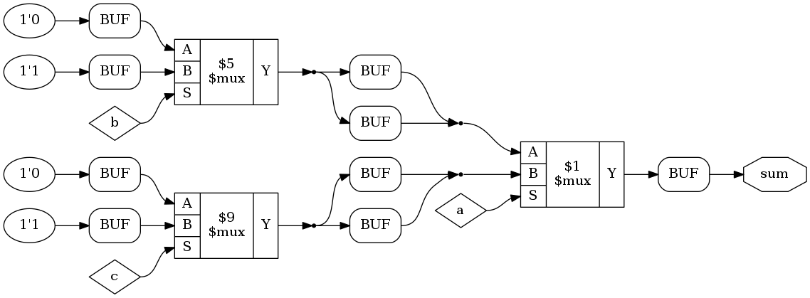
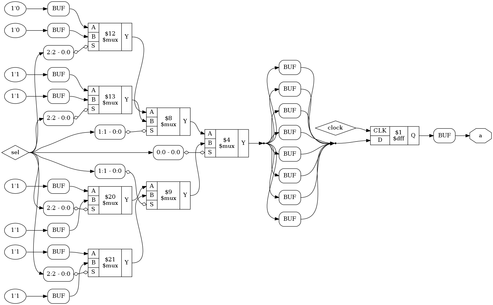
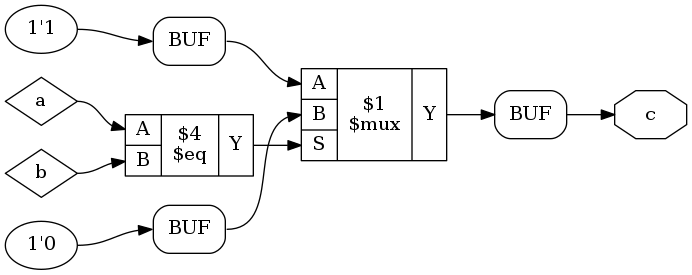
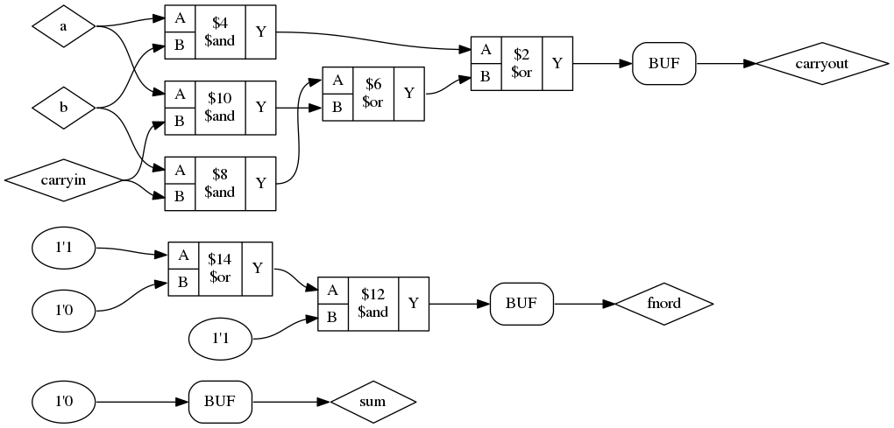

# Yodl

This is a work in progress VHDL frontend
for the Yosys toolchain.

### 8. Sept 2016


The last few weeks, I finished up the first experimental netlist synthesis
algorithm for the use in my thesis. The latter, sadly, is due in about 14 days,
hence I won't be able to develop Yodl for at least 2 weeks.

Here are some teasers what's currently possible. Note, that some example serve
as illustration of how the synthesis algorithm produces netlists and aren't
necessarily sound or even semantically correct (since there are no semantic
checks yet :))

1. Simple signal assignment synchronization
```vhdl
architecture behv of adder is
   function rising_edge(c : in std_logic) return std_logic;
begin
   process(A) is
   begin
      if rising_edge(clock) then
         A <= '0';
      end if;
   end process;
end behv;
```


2. Nested synchonization
```vhdl
-- [...]
-- A and clock are both of type std_logic
architecture behv of adder is
   function rising_edge(c : in std_logic) return std_logic;
begin
   process(A) is
   begin
      if rising_edge(clock) then
         if rising_edge(clock) then
            A <= '0';
         end if;
      end if;
   end process;
end behv;
```


3. Simple latched signal assignment
```vhdl
-- same libraries as above
-- A, B and C are of type std_logic
architecture behv of adder is
   function rising_edge(c : in std_logic) return boolean;
begin
   process(A) is
   begin
      if A = B then
         C <= '1';
      end if;
   end process;
end behv;
```


4. Nested latched signal assignment

```vhdl
-- [...]
-- same preamble as above
   process(A) is
   begin
      if A = B then
         if not A then
             C <= '1';
         end if;
      end if;
   end process;
end behv;
```


5. Simple case synthesis
```vhdl
-- same libraries as before
-- A is a std_logic and baz a std_logic_vector(2 downto 0)
architecture behv of caseT is
begin
   process(A) is
   begin
      case baz is
         when "000" => A <= '0';
         when "001" => A <= '1';
         when "010" => A <= '1';
         when "011" => A <= '1';
         when "100" => A <= '0';
         when "101" => A <= '1';
         when "110" => A <= '1';
         when "111" => A <= '1';
      end case;
   end process;
end behv;
```


6. Nested case synthesis
```vhdl
-- same libraries as before
-- A, B, C and sum are ports of type std_logic
architecture behv of adder is
begin
   process(A) is
   begin
      case A is
         when '0' => case B is
                        when '0' => sum <= '0';
                        when '1' => sum <= '1';
                     end case;
         when '1' => case C is
                        when '0' => sum <= '0';
                        when '1' => sum <= '1';
                     end case;
      end case;
   end process;
end behv;
```



7. Synchronized case statement
```vhdl
-- [...]
-- A, clock are ports of type std_logic and
-- sel is a std_logic_vector(2 downto 0)

architecture behv of syncCase is
   function rising_edge(c : in std_logic) return std_logic;
begin
   process(A) is
   begin
      if rising_edge(clock) then
         case sel is
            when "000" => A <= '0';
            when "001" => A <= '1';
            when "010" => A <= '1';
            when "011" => A <= '1';
            when "100" => A <= '0';
            when "101" => A <= '1';
            when "110" => A <= '1';
            when "111" => A <= '1';
         end case;
      end if;
   end process;
end behv;
```


8. If statement with complete signal assignments
```vhdl
-- [...]
-- A, B and C are ports of type std_logic
architecture behv of adder is
   function rising_edge(c : in std_logic) return boolean;
begin
   process(A) is
   begin
      if A = B then
         C <= '0';
      else
         C <= '1';
      end if;
   end process;
```


9. Complete nonsensical clusterfuck
```vhdl
library ieee;
use ieee.std_logic_1164.all;
use ieee.std_logic_arith.all;
use ieee.std_logic_unsigned.all;

entity clufu is
   port(A       : out std_logic;
        B       : out std_logic;
        Co      : out std_logic;
        sel    : in  std_logic_vector(1 downto 0);
        enable  : in  std_logic;
        enable2 : in  std_logic;
        clock    : in  std_logic);
end clufu;

architecture b of clufu is
   function rising_edge(c : in std_logic) return boolean;
begin
   process(A) is
   begin
      if A = B then
         if not A then
            if rising_edge(clock) then
               case sel is
                  when "00" =>
                     if rising_edge(clock) and enable = '1' and (not enable2 = '0') then
                        Co <= '0';
                     end if;
                  when "01" => Co <= '1';
                  when "10" => Co <= '1';
                  when "11" => Co <= '1';
               end case;
            end if;
         end if;
      end if;
   end process;
end b;
```


### 19. Aug 2016

Due to the current parser's limitations, a new parser needs to be written.
I intend to use BNFC for this task. BNFC provides two things:

1. A formalism for lexical and syntactic specifications: LBNF
1. A program generator that transforms those specs from LBNF into a complete
   frontend for various languages (of course C/C++
   is one ot the target languages)

I transcribed the official syntax (written in EBNF = Extended Backus Naur Form)
into LBNF and tested out the frontend generation. In principle this is working
now.

However, the real difficult things are yet to come!. LBNF does not support
ambiguous context free grammars in particular. That means that it has to be
modified in order to resolve this issue. Bison can generate GLR parsers.
A rule of thumb is: If your grammar only contains shift/reduce conflicts:
Generate a GLR parser and you are golden. VHDL contains more shift/reduce conflicts
than one can count and -- in addition to that -- a lot of reduce/reduce conflicts.
Since RR-Conflicts makes a context free grammar produce more than one parse tree,
the rule-of-thumb solution can't be applied here.

Every glr-ed bison grammar can be equipped with so called merge rules which
deal with RR-conflicts. As the priviously mentioned
[article](http://eli.thegreenplace.net/2009/05/19/parsing-vhdl-is-very-hard)
describes, the merge rules need to keep track of
all scopes and all occuring type, variable, signal, and function declarations in
order to be able to correctly resolve the conflicts. Stephen Williams' `parse.y`
nicely shows, how this can be achived.

The remaining problem, again, regards the sr-conflicts. Are we really sure that
they don't lift the grammar into the set of non-deterministically context free
languages? In other words: How do we know for sure, that all remaining sr-conflicts
can be resolved solely by the usage of a GLR parser?

This is a non-trivial question and it's answer can possibly constructed with:

1. Knowledge of the GLR parsing algorithm. (GLR = LR(n) with n being unlimited)
2. Does any parser split, provoked by a SR-conflict, ultimately lead to only one
   living parser for each path?

I'll elaborate on this topic as soon as I have understood the problem entirely.

### 16. Aug 2016

Today is a day to celebrate. First actual netlist has been created!
Yodl translated this
```
library ieee;
use ieee.std_logic_1164.all;
use ieee.std_logic_arith.all;
use ieee.std_logic_unsigned.all;

entity adder is
   port(A        : in  std_logic;
        B        : in  std_logic;
        carryIn  : in  std_logic;
        carryOut : out std_logic;
        fnord    : out std_logic;
        sum      : out std_logic);
end adder;

architecture behv of adder is
begin
--   sum      <= A xor B xor carryIn;
   sum <= '0';
   carryOut <= (a and b) or
               (b and carryIn) or
               (a and carryIn);

   fnord <= ('1' or '0') and '1';
end behv;
```

into that:



### 4. Aug 2016

I did further research on the topic `parse all of VHDL 2008`. There
is a [project](https://github.com/BNFC/bnfc) that automates away most of the hugely repetitive work of writing an compiler frontend. Moreover, I found a repository on github that contains a copy of VHDL-2008 bnf grammar. Sadly the author simply copy pasted it from the original reference manual. This is unformunate, because the BNF derivative the IEEE authors use in their manual is not at all copy paste friendly because of their glorious `semantic rule prefixes`.
Hence the standard text contains grammar rules like: *package*_simple_name ::= foobar. A *package*_simple_name simply is a simple_name but prefixed for better understandability. Since there is no italic font for plain text files, I now manually have to check the complete grammar (1300 LoC) and remove the semantic prefixes.


`Previous notes:` Currently I'm able to completely evaluate
generate statements and for loops (for and if; case generate is not supported, but will be).
Speaking of for loops, there is a grain of salt. The VHDL synthesis
standard from 2004 pinpoints that `next` and `exit` statements be explicitly
allowed inside of for loops. This is a problem, because in certain cases an
occuring statement of those two types can make the whole loop (statically) non-evaluable.
Thus my current for loop unroller does *not* support them.

Furthermore I built appropriate infrastructure for AST traversals which is
largely functor based and not very well documented at this point of time.

As of now, I also accomplished:
- elsif elimination. The elsif eliminator transforms
```vhdl
    if (3=3) then
      s1;
    elsif (4=4) then
      s2;
    else
      s3;
    end if;
```
  into
```vhdl
    if (3=3) then
      s1;
    else
      if (4=4) then
        s2;
      else
        s3;
      end if;
    end if;
```

- if/else to case transformation. The functor BranchesToCases transforms
```vhdl
    if (3=3) then
      s1;
    else
      if (4=4) then
        s2;
      else
        s3;
      end if;
    end if;
```
  into
```vhdl
  case (3=3) is
    when TRUE => s1;
    when FALSE =>
      case (4=4) is
        when TRUE => s2;
        when FALSE => s3;
      end case;
  end case;
```
  Now the multiplexer structures that are modelled by if/elsif/else-clauses
  become obvious and are hopefully simple enough to translate to Cliffords RTLIL-API.

`A rant about VHDL's grammar: `. VHDL's grammar is utterly ambiguous. There are
a lot of reduce/reduce (and even more shift/reduce) conflicts in the grammar.
Reduce/reduce conflicts (in context LR(1)) usually is a very strong implication
for the grammar being in the class of non-deterministic context free languages and
this is *bad news* because it further implies, that parsing is very _very_ hard.

There already is a pretty good [article](http://eli.thegreenplace.net/2009/05/19/parsing-vhdl-is-very-hard) about this that I want to refer to.

Stephen Williams wrote a pretty slick `parse.y` that properly matches most of VHDL's syntax. Sadly, there
are some ugly twists that he had to make in order to unambiguously construct just one parse tree for any
given input. I thought a bit and came to the conclusion that it might be best, to rewrite the parser by using
one of bisons newer features: GLR, Generalized LR, an algorithm for ambiguous grammars.

As an example what the current parser cannot (and probably will never be able to) parse is:
```vhdl
architecture beh of ent is
   -- some decls
begin
   -- this should be parsable, but produces syntax error
   result <= foo(fnord => 3, foobar => 4)(3);

   -- this is parsable
    result <= foo(4, 3)(3);
end beh;
```

The problem is that the alterations of VHDL's grammar also
affected how names (identifiers, array indexing, ...) are matched.
The standard dictates that a name is parsed as

```
name ->   prefix ( expression {, expression } )
        | prefix . suffix
        | operator_symbol
        | identifier

prefix -> name | function_call

function_call -> name ( association_list )

suffix consists solely of terminal symbols
```

whereas `parse.y` specifies prefixes as

    prefix -> name

and emulates function calls inside of expressions
by misusing the

    prefix ( expression {, expression } )

rule.


## Current milestone

Be able to generate RTLIL from a subset
of VHDL.

## Ultimate goal

Be able to generate (correct) RTLIL from
VHDL as specified in IEEE 1076.6-2004.
